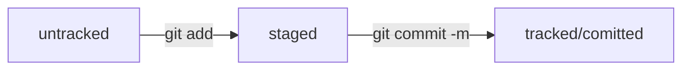

# GIT

## Установка GIT

Перейти на официальный сайт git [https://git-scm.com/download] и скачать нужную версию.

Далее запускаем установщик.

`git version` - Если Git установлен правильно, консоль выведет его текущую версию.

## Настройка GIT

Работа с файлом настройки `.gitconfig`
Сейчас вы работаете в одиночку, но в дальнейшем вам может понадобиться использовать Git в команде. Чтобы участникам проекта было понятно, кто и какие изменения вносил, нужно представиться и указать имя пользователя и адрес электронной почты.
Вы можете указать любую электронную почту и любое имя. Сделать это можно с помощью команды `git config` (от англ. configuration — «конфигурация», «настройка») с ключом `--global` (англ. «глобальный»). При этом не имеет значения, в какой директории вы находитесь прямо сейчас: вызов `git config --global` сработает везде.

```BASH
git config --global user.name "User Namovich" 
# имя или ник нужно написать латиницей и в кавычках

git config --global user.email username@yandex.ru
# здесь нужно указать свой настоящий email
```

Все глобальные настройки Git хранит в файле .gitconfig в домашней директории. Команда запишет в этот файл указанные имя и почту. Чтобы убедиться в этом, можно вызвать команду для чтения файлов `cat ~/.gitconfig`.
Другой способ проверки — вывести содержимое файла конфигурации Git той же командой git config с флагом --list (англ. «список»).

## Инициализация репозитория

Сделать папку репозиторием — `git init` (необходимо перейти в нужную директорию `cd`)

«Разгитить» папку, если что-то пошло не так, — `rm -rf .git`. Удаление скрытой папки ".git". 

ключ `-r` (от англ. recursive — «рекурсивно») позволяет удалять папки вместе с их содержимым

ключ `-f` (от англ. force — «заставить») избавит вас от вопросов вроде «Вы точно хотите удалить этот файл?»

Проверить состояние репозитория — `git status`

## Добавление файлов в репозиторий

Подготовить файлы к сохранению — `git add`.

Команда `git add --all` подготовит к сохранению сразу все файлы.

С помощью `git add .` можно добавить в репозиторий текущую папку со всеми файлами.

Добавлять файлы можно и по одному `git add example.txt`

## Коммит

Коммит — это одна из основных сущностей в Git (и в других системах контроля версий). Коммит гарантирует, что изменения будут сохранены в истории и при необходимости к ним можно будет «откатиться».

Выполнить коммит — `git commit`

Сделать коммит можно командой `git commit -m "коментарий"` (от англ. message — «сообщение»), который присваивает коммиту сообщение (коментарий).

Команда в том числе выведет следующую информацию:
Строки вида `create mode 100644 readme.txt` — это более подробная информация о новых (добавленных в Git) файлах.
* `create` (англ. «создать») говорит, что файл был создан. Если бы файл был удалён, на этом месте было бы слово `delete` (англ. «удалить»).
* `mode 100644 сообщает`, что это обычный файл. Также возможны варианты `100755` для исполняемых файлов (например, `что-нибудь.exe`) и `120000` для файлов-ссылок в Linux. Файлы-ссылки не содержат данных сами по себе, а только ссылаются на другие файлы — как «ярлыки» в Windows.

## Просмотр истории коммитов

Просмотреть историю коммитов — `git log`  
Последние коммиты оказываются первыми сверху

# GitHub

[GitHub](https://github.com/ "Сайт GitHub") — платформа для хранения IT-проектов и совместной работы над ними с использованием Git.

Git и GitHub — это два разных проекта, которые развиваются независимо друг от друга.

Git:
- консольный инструмент для работы с локальными и удалёнными репозиториями;
- проект с открытым исходным кодом.

GitHub:
- платформа для размещения удалённых репозиториев;
- принадлежит компании Microsoft.

## Инструкция по созданию репозитория на GitHub

1. Создайте репозиторий. Для этого перейдите на вкладку Repositories (англ. «репозитории»), а затем нажмите на зелёную кнопку **New** (англ. «новый») справа.

2. Открылось окно создания нового репозитория. Назовите его. Название удалённого репозитория необязательно должно совпадать с именем папки проекта у вас на компьютере. Нажимайте на зелёную кнопку **Create repository**.

## SSH

Один из наиболее распространённых сетевых протоколов — SSH (от англ. Secure Shell Protocol). Он обеспечивает безопасный обмен данными в сети. С помощью этого протокола можно получать данные с удалённого компьютера или отправлять их на него. Трафик шифруется, поэтому протокол безопасен.

SSH использует пару ключей для обеспечения безопасности — публичный и приватный: 
* Приватный ключ (англ. private key) хранится только на вашем компьютере и не должен передаваться кому-либо ещё. Он используется для расшифровки данных.
* Публичный ключ (англ. public key) доступен всем и используется для шифрования данных. Они могут быть расшифрованы парным приватным ключом.

Только вы можете расшифровать данные с помощью приватного ключа, но любой владелец публичного ключа может их для вас зашифровать. Эти два ключа связаны и образуют SSH-пару.

По умолчанию директория с SSH-ключами находится в домашней директории пользователя. Обычно SSH-ключи находятся в директории .ssh/. Проверить наличие этой директории и файлов в ней можно с помощью команды `ls -la .ssh/`.

### Генерация ключа

1. Для генерации SSH-пары можно использовать программу ssh-keygen. Откройте терминал и введите следующую команду.
```bash
ssh-keygen -t ed25519 -C "электронная почта, к которой привязан ваш аккаунт на GitHub"
```

Если вы видите сообщение об ошибке, то, скорее всего, ваша система не поддерживает алгоритм шифрования ed25519. Ничего страшного: используйте другой алгоритм.
```BASH
$ ssh-keygen -t rsa -b 4096 -C "электронная почта, к которой привязан ваш аккаунт на GitHub"
```

2. Укажите место хранения ключей. Простой вариант — сделать домашний каталог пользователя путём по умолчанию. Для этого нажмите `Enter`.

Или ввести команду (для Windows): `> Enter a file in which to save the key (C:\Users\<имя_пользователя>\.ssh\):[Press enter]`

Теперь в указанной директории появится пара ключей.

3. Программа запросит кодовую фразу (англ. passphrase) для доступа к SSH-ключу. Вы можете оставить поле пустым. Для этого нажмите `Enter`, а затем ещё раз `Enter` для подтверждения.

4. Теперь осталось проверить, что ключи действительно сгенерировались. Для этого вызовите эту команду `ls -a ~/.ssh`

На экране должны появиться два файла — один с расширением .pub, другой — без. Файл в .pub — публичный, им можно делиться с веб-сайтами или коллегами. Файл без расширения .pub — приватный. Ни в коем случае не передавайте его никому!

### Привязка ключа к GitHub

1. Скопируйте содержимое файла с публичным ключом в буфер обмена.
```BASH
# скопировать содержимое ключа в буфер обмена:
$ clip < ~/.ssh/id_rsa.pub
# для ed25519:
$ clip < ~/.ssh/id_ed25519.pub
```

Если `clip` не сработает, выведите содержимое файла с помощью `cat ~/.ssh/id_rsa.pub` или `cat ~/.ssh/id_ed25519.pub` и скопируйте вывод в буфер обмена из консоли.

2. Перейдите на GitHub и выберите пункт Settings (англ. «настройки») в меню аккаунта.

3. В меню слева нажмите на пункт SSH and GPG keys.

4. В открывшейся вкладке выберите New SSH key (англ. «новый SSH-ключ»).

5. В поле Title (англ. «заголовок») напишите название ключа. Например, Personal key (англ. «личный ключ»).

6. В поле Key type (англ. «тип ключа») должно быть Authentication Key (англ. «ключ аутентификации»).

7. В поле Key скопируйте ваш ключ из буфера обмена.

8. Нажмите на кнопку **Add SSH key** (англ. «добавить SSH-ключ»).

9. Проверьте правильность ключа с помощью следующей команды. `ssh -T git@github.com`. Если это первый раз, когда вы используете Git, чтобы поделиться проектом на GitHub, появится похожее предупреждение. Введите yes, чтобы продолжить.  

## Связываем локальный и удалённый репозитории

Привязать удалённый репозиторий к локальному — `git remote add`

Перейдите на страницу удалённого репозитория, выберите тип SSH и скопируйте URL. Кнопка справа позволит сделать это мгновенно.

Откройте консоль, перейдите в каталог локального репозитория и введите команду git remote add (от англ. remote — «удалённый» и add — «добавить»).

`git remote add origin git@github.com:%ИМЯ_АККАУНТА%/first-project.git`

Команде необходимо передать два параметра: имя удалённого репозитория и его URL. В качестве имени используйте слово origin. А URL вы скопировали со страницы удалённого репозитория.

Убедиться, что репозитории связаны, — `git remote -v`
Флаг -v — короткая форма флага --verbose (англ. «подробный»). Он позволяет показать больше информации в выводе.

## Синхронизируем локальный и удалённый репозитории

Отправить изменения на удалённый репозиторий — `git push`

В первый раз эту команду нужно вызвать с флагом -u и параметрами origin (имя удалённого репозитория) и main или master (название текущей ветки). Флаг -u свяжет локальную ветку с одноимённой удалённой.

```BASH
$ git push -u origin main # Если команда приведёт к ошибке, попробуйте 
                          # заменить main на master.
```

В дальнейшем при работе с удалённым репозиторием флаг `-u` можно опустить и писать просто `git push`.

# Навигация по коммитам

## Хеш — идентификатор коммита

Хеширование (от англ. hash, «рубить», «крошить», «мешанина») — это способ преобразовать набор данных и получить их «отпечаток» (англ. fingerprint).

Git хеширует (преобразует) информацию о коммите с помощью алгоритма SHA-1 (от англ. Secure Hash Algorithm — «безопасный алгоритм хеширования») и получает для каждого коммита свой уникальный хеш — результат хеширования.

При работе с Git хеши будут встречаться вам регулярно. Их можно будет передавать в качестве параметра разным Git-командам, чтобы указать, с каким коммитом нужно произвести то или иное действие.

## Исследуем log

Получить сокращённый лог — `git log --oneline`

если выход из просмотра логов не произошёл автоматически, нажмите клавишу Q (от англ. Quit — «выйти») в английской раскладке клавиатуры.

## Файл HEAD

Файл HEAD (англ. «голова», «головной») — один из служебных файлов папки .git. Он указывает на коммит, который сделан последним (то есть на самый новый).

Внутри HEAD — ссылка на служебный файл: refs/heads/master (или refs/heads/main в зависимости от названия ветки). Если заглянуть в этот файл, можно увидеть хеш последнего коммита.

```BASH
$ pwd # посмотрели, где мы
/Users/user/dev/first-project

$ cd .git/
$ ls # посмотрели, какие есть файлы
COMMIT_EDITMSG  ORIG_HEAD  description  index  logs/     refs/
HEAD            config     hooks/       info/  objects/

$ cat HEAD # команда cat показывает содержимое файла
ref: refs/heads/master # в файле вот такая ссылка

$ cat refs/heads/master # взяли ссылку из файла HEAD
# внутри хеш
e007f5035f113f9abca78fe2149c593959da5eb7

$ git log 
# сверяем с хешем последнего коммита
commit e007f5035f113f9abca78fe2149c593959da5eb7
Author: John Doe <johndoe@example.com>
Date:   Tue Mar 28 00:26:53 2023 +0300

    Добавить амбиций в список дел

... # другие коммиты 
```

## Статусы файлов в Git

* __untracked__ (англ. «неотслеживаемый»)

Мы говорили, что новые файлы в Git-репозитории помечаются как `untracked`, то есть неотслеживаемые. Git «видит», что такой файл существует, но не следит за изменениями в нём. У untracked-файла нет предыдущих версий, зафиксированных в коммитах или через команду `git add`.

* __staged__ (англ. «подготовленный»)

  После выполнения команды `git add` файл попадает в staging area (от англ. stage — «сцена», «этап [процесса]» и area — «область»), то есть в список файлов, которые войдут в коммит. В этот момент файл находится в состоянии staged.

Staging area также называют index (англ. «каталог») или cache (англ. «кеш»), а состояние файла staged иногда называют indexed или cached.
Все три варианта могут встречаться в документации и в качестве флагов команд Git.

* __tracked__ (англ. «отслеживаемый»)

Состояние tracked — это противоположность untracked. Оно довольно широкое по смыслу: в него попадают файлы, которые уже были зафиксированы с помощью `git commit`, а также файлы, которые были добавлены в staging area командой `git add`. То есть все файлы, в которых Git так или иначе отслеживает изменения.

* __modified__ (англ. «изменённый»)

Состояние modified означает, что Git сравнил содержимое файла с последней сохранённой версией и нашёл отличия. Например, файл был закоммичен и после этого изменён.

## Как читать git status

`git status` показывает только следующие состояния файлов:
- staged (Changes to be committed в выводе git status);
- modified (Changes not staged for commit);
- untracked (Untracked files).

## Mermaid-Схема



## Как исправить коммит

`git commit --amend` (от англ. amend — «исправить», «дополнить»)  
опция --amend работает только с последним коммитом (HEAD). 

`git commit --amend --no-edit`  
Обратите внимание на опцию `--no-edit`. Она сообщает команде commit, что сообщение коммита нужно оставить как было.

Точно так же можно добавить не новый файл, а дополнительные изменения в уже добавленном в коммит файле.

Изменить сообщение коммита — `git commit --amend -m "Новое сообщение"`

## Откат к прошлым версиям

Выполнить unstage изменений — `git restore --staged <file>`

Чтобы «сбросить» все файлы из staged обратно в untracked/modified, можно воспользоваться командой `git restore --staged .`: она сбросит всю текущую папку (`.`).

«Откатить» коммит — `git reset --hard <commit hash>`

«Откатить» изменения, которые не попали ни в staging, ни в коммит, — `git restore <file>`

## Просматриваем изменения в файлах

это позволяет делать команда `git diff` (от англ. difference — «отличие», «разница»).  
по умолчанию команда `git diff` не показывает изменения в staged-файлах — только в modified.

Чтобы просмотреть изменения в staged, нужно использовать флаг --staged: `git diff --staged`.

чтобы сравнить два произвольных коммита: `git diff <hash1> <hash2>

# Игнорирование файлов в Git

Чтобы Git игнорировал файлы и не пытался добавить их в репозиторий, нужно создать файл `.gitignore` (от англ. ignore — «игнорировать») и записать в него названия игнорируемых файлов.

Если строка начинается с #, то это комментарий, и .gitignore не будет его учитывать.

Допустим, нужно, чтобы Git игнорировал все файлы .DS_Store. Для этого достаточно добавить в .gitignore строку с названием файла.

В таком случае Git будет игнорировать файлы с именем .DS_Store, причём не только в корне репозитория, но и во всех вложенных папках.

Символ звёздочки (*) соответствует любой строке, включая пустую. Если такой символ используется в шаблоне в .gitignore, значит, файл будет проигнорирован вне зависимости от того, что будет на месте звёздочки.  
`*.jpeg`  
`docs/*/tmp`
Теперь Git будет игнорировать все файлы, которые заканчиваются на .jpeg — пригодится тем, кто не любит картинки. А также все временные файлы tmp (от англ. temporary — «временный») в подпапках папки docs. Например, Git проигнорирует файл docs/current/tmp.

Вопросительный знак ? соответствует одному любому символу. `file?.txt`  

Квадратные скобки, как и вопросительный знак, соответствуют одному символу. При этом символ не любой, а только из списка, который указан в скобках. `file[0-2].txt`. В скобках можно либо перечислить символы ([abc]), либо задать диапазон ([a-z]).

Косая черта, или слеш (/), указывает на каталоги. Если шаблон в .gitignore начинается со слеша, то Git проигнорирует файлы или каталоги только в корневой директории.

```bash
# игнорировать todo.txt в корне репозитория
/todo.txt

# для сравнения: spam.txt будет игнорироваться во всех папках
spam.txt

# игнорировать папку build
build/ 
```

Функция парных звёздочек (**) похожа на функцию одинарной (*). Отличие в том, как они работают с вложенными папками. Двойная звёздочка может соответствовать любому количеству таких папок (в том числе нулю). Одинарная может соответствовать только одной.

```bash
# игнорировать файлы "docs/current/tmp", "docs/old/tmp",
# а также "docs/old/saved/a/b/c/d/tmp"
# и даже "docs/tmp", потому что ноль вложенных папок тоже подходит
docs/**/tmp

# игнорировать только "docs/current/tmp" и "docs/old/tmp"
# файл "docs/old/saved/a/b/c/d/tmp" не попадает в правило
docs/*/tmp 
```

Любое правило в файле .gitignore можно инвертировать с помощью восклицательного знака (!).

```bash
# игнорировать все JPEG-файлы
*.jpeg

# но только не мем с Doge
!doge.jpeg
```

Если всё же нужно отобразить все игнорируемые файлы, то это можно сделать с помощью ключа --ignored: git status --ignored. В таком случае в выводе git status появится раздел Ignored files.

# Клонируем репозиторий

`git clone <adress>`

# Ветки

Просмотреть ветки проекта — `git branch`

Создать ветку — `git branch <название_ветки>`

Название ветки в Git может состоять из букв, цифр, а также включать любой из четырёх символов: ., -, _, /. Эти символы не несут особого смысла. Например, ветка feature/add-branch-info могла бы называться feature_add-branch-info или feature-add-branch. Обратите внимание, что ветки не образуют иерархии, как директории, разделённые символом /.

Переключиться на другую ветку — `git checkout <название_ветки>`

Создать ветку и сразу переключиться на неё — `git checkout -b <название_ветки>`  
флаг `-b` (от англ. branch)

Сравнить ветки — `git diff <название_ветки1> <название_ветки2>`

`git diff HEAD main` покажет разницу между коммитом, который сделан последним, и веткой main.

`git diff main feature/diff` покажет изменения, которые нужны, чтобы получить состояние ветки feature/diff из ветки main.

в Git есть суффикс навигации `~N`, где N — это число. Он отсчитывает от заданного коммита N коммитов назад во времени. Нумерация начинается с нуля: `commit~0` — это сам коммит, `commit~1` — предыдущий, `commit~2` — предшествующий предыдущему и так далее.

Например, `HEAD~1` — это следующий за текущим коммит. А `main~5` — это пятый коммит в ветке main, если считать с последнего выполненного коммита.

На практике чаще нужен либо текущий коммит (`HEAD`), либо следующий за ним (`HEAD~1`). Для `~1` есть специальное сокращение `~` (без числа). То есть вместо `HEAD~1` обычно пишут просто `HEAD~`.

Или можно использовать хеши. `git diff 2ea56ab~ 2ea56ab`

# Слияние

Выполнить слияние — `git merge <название_ветки>`

Перед тем как начать процесс слияния, нужно перейти в ветку, куда должны добавиться изменения. Обычно это главная ветка. Перейдите в неё и вызовите команду git merge с именем присоединяемой ветки feature/diff в качестве параметра.

В сообщении после слияния содержится следующая информация:  
* `Updating 079cfbf..f30d441` — значит, что коммиты c 079cfbf по f30d441 были объединены.
* `Fast-forward` — это режим слияния. Fast-forward (англ. «перемотка») значит, что итогом слияния будет линейная история коммитов. Такое происходит, когда истории двух веток находятся на одной прямой — то есть когда одна ветка продолжает историю, начатую другой.
* Информация о конкретных изменениях. В нашем примере поменялся файл README.md (1 file changed): в нём теперь две новые строки (2 insertions(+)).

Удалить ветку после объединения — `git branch -D <название_ветки>`

Полная форма этого флага `-D` — `--delete --force` (от англ. delete — «удалить» и force — «сила», «принудить».

У команды git branch -D есть более безопасный вариант с флагом `-d`. Полная форма этого флага — `--delete`. Он удалит ветку только если она была полностью объединена с другой — то есть если две ветки стали (или изначально были) частью одной истории.

Удаление локальной ветки через Git не удаляет ветку на GitHub!

# Как разрешать конфликты: общие рекомендации

Во время слияния Git сам подсвечивает файлы, которые не смог объединить. Чтобы разобраться в ситуации, нужно сделать следующее:

1. Заглянуть в файл, где произошёл конфликт.
2. Изучить обе стороны конфликта — вашу версию и версию вашего коллеги. Ваша задача — правильно собрать две версии в итоговую, так чтобы изменения обеих сторон не потерялись. Новая версия станет текущей актуальной.
3. Вручную удалить или подправить неактуальные изменения, если они есть.
4. Подготовить изменения к сохранению и сделать коммит.

https://git-scm.com/book/ru/v2/Инструменты-Git-Продвинутое-слияние

# Создаём pull request

У каждого пул-реквеста есть:  
* Название — краткое описание предлагаемых изменений. Например: `Адаптивный заголовок сайта`, `Замена альбома на галерею` и так далее.
* Описание — развёрнутое описание изменений. Это поле заполнять необязательно, но желательно.
* Исходная ветка — та, в которой вы работали. Например, `feature/merge-request`.
* Целевая ветка — основная ветка проекта, в которую вы хотите внести изменения.

Также у каждого пул-реквеста может быть два исхода:  
* merge (англ. «соединить») — предлагаемые изменения приняты; код вливается в целевую ветку; пул-реквест закрывается.
* close (англ. «закрыть») — пул-реквест закрывается без слияния изменений.

## Делаем pull request

__Первый способ.__ При создании новой ветки в удалённом репозитории Git распечатает сообщение. Оно включает ссылку на создание пул-реквеста.

```bash
remote: Create a pull request for 'feat/diff' on GitHub by visiting:
remote:      https://github.com/%ВАШ_АККАУНТ%/git-branches/pull/new/feature/merge-request
```

Останется только скопировать её в адресную строку браузера, заполнить необходимые поля и нажать __Create pull request__ (англ. «создать запрос на изменения»). Многие терминалы также позволяют кликнуть на эту ссылку — напрямую или через комбинацию Cmd / Ctrl + клик.

__Второй способ.__ Чтобы создать пул-реквест для любой существующей ветки на GitHub, перейдите на страницу репозитория, а затем выберите вкладку __Pull requests__ в верхней части экрана. Нажмите на зелёную кнопку __New pull request__ (англ. «новый запрос на изменения»).

Выберите названия веток: ветка «откуда» (из которой будет происходить пул-реквест) и ветка «куда» (в которую он будет осуществлён). В нашем случае изменения должны попасть из ветки feature/merge-request в ветку main. На направление изменений указывает стрелка.

В окне ниже отобразится несколько коммитов, а также их изменения. Нажмите на кнопку __Create pull request__.

Заполните поля с названием и описанием пул-реквеста. Нажмите __Create pull request__.

Готово: пул-реквест создан! Теперь вы или ваши коллеги могут перейти на вкладку __Files changed__ (англ. «изменённые файлы»), чтобы оставить свои комментарии — провести ревью.

По окончании ревью можно посмотреть комментарии и обсудить изменения на вкладке __Pull requests__. Также вы можете в любой момент добавить дополнительные коммиты в ветку — они автоматически попадут в открытый пул-реквест после пуша.

Осталось только нажать на кнопку __Merge pull request__ (англ. «принять запрос на изменения») — это действие объединит ветку с вашими изменениями и ветку main.

# Забираем изменения из удалённого репозитория

Чтобы скачать изменения из удалённого репозитория, следует выполнить команду `git pull` (от англ. pull — «вытянуть») — стянуть, или «запулить» изменения.

Перед созданием нового пул-реквеста считается хорошей практикой перейти в главную ветку, «подтянуть» в неё изменения, а затем добавить эти изменения в вашу ветку с помощью git merge main.

# Что такое fast-forward

Fast-forward слияние веток можно отключить флагом `--no-ff`. Например: `git merge --no-ff add-docs`. Также его можно отключить «навсегда» (до тех пор, пока вы не вернёте настройку «как было») с помощью настройки `merge.ff: git config [--global] merge.ff false`.

Если отключить слияние в режиме fast-forward, вместо «перемотки» ветки Git создаст в ней коммит слияния (англ. merge commit) — в обиходе его называют merge-коммит или мёрж-коммит. В этом случае результат «вливания» ветки add-docs в main выглядел бы так.

```bash
# находимся в ветке main
# --no-edit отключает ввод сообщения для merge-коммита
# --no-ff отключает fast-forward слияние веток
$ git merge --no-edit --no-ff add-docs
Merge made by the 'ort' strategy.
 docs.txt | 1 +
 1 file changed, 1 insertion(+)
 create mode 100644 docs.txt

# с флагом --graph
# Git нарисует ветки с помощью «палочек» и «звёздочек»
# получившийся коммит слияния: 6814789
$ git log --graph --oneline
*   6814789 (HEAD -> main) Merge branch 'add-docs'
|\
| * e08fa2a (add-docs) New docs 2
| * fd588b2 New docs 1
|/
* 997d9ce Commit 4
* 0313e8e Commit 3
* 5848aba Commit 2
* 04923d7 Commit 1
```

# Разрешение конфликта

Когда Git выявляет конфликт, он помечает проблемные файлы и останавливает процесс слияния.

Если выполнить git status в процессе «мёржа», файлы с маркерами конфликтов будут отображаться в особой категории Unmerged paths (англ. «не соединённые пути») с текстом both modified (англ. «оба изменены»).

Git разметил файл. Получившиеся секции содержат изменения из каждой ветки:  
* Текст между `<<<<<<< HEAD` и `=======` указывает на изменения, которые находятся в HEAD — в данном случае это ветка main. Здесь окажутся только те строки, в которых есть конфликт.
* Текст между `=======` и `>>>>>>> br2` показывает на изменения, которые находятся в ветке br2.

Чтобы разрешить конфликт вручную, нужно открыть файл и выбрать, какие изменения оставить, а какие отбросить. Для этого следует удалить все маркеры и ненужные изменения и оставить нужные. После разрешения конфликта файлы будут отмечены как решённые. Можно продолжить процесс слияния или выполнить коммит изменений.

вы наверняка не раз сталкивались с редактором Vim в консоли. Он также предоставляет инструмент слияния, который называется vimdiff. Чтобы его вызвать, при возникновении конфликта нужно выполнить команду `git mergetool`.

`git log --oneline --abbrev-commit --graph --date=short --pretty=format:'%h - %an, %cd : %s'`. У каждого флага своя функция. `--abbrev-commit` покажет только первые несколько символов из хеша коммита; `--graph` выведет результат в виде графа; `--date=short` выведет дату в формате yyyy-MM-dd, например 2023-07-12; `--pretty=format:'%h - %an, %cd : %s'` задаёт формат выдачи результата.

